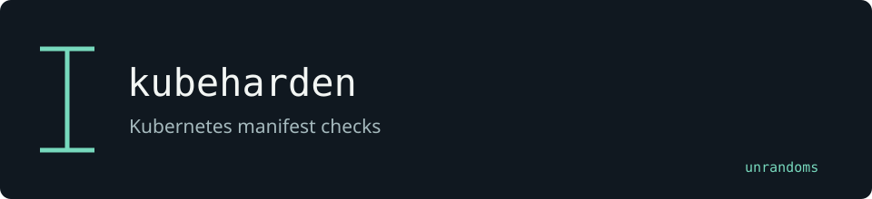

# kubeharden

Statically checks Kubernetes manifests. Local extensions add security-context checks, OPA evaluation and baseline suppression.

Maintained by [unrandoms](https://github.com/unrandoms), derived from [zegl/kube-score](https://github.com/zegl/kube-score).

## Fork-specific work

- [`score/security/security.go`](score/security/security.go)
- [`score/opa/opa.go`](score/opa/opa.go)
- [`score/baseline/baseline.go`](score/baseline/baseline.go)

## Validation and limits

A static result describes the supplied manifests. It does not verify the live cluster, admission configuration or runtime state.

This documentation update does not certify all inherited features. The [archived reference](UPSTREAM_README.md) describes the original ecosystem; its package names and release links may target upstream rather than this fork.

## Credits

See [CREDITS.md](CREDITS.md) for the distinction between the original implementation and this fork's adaptations. Original licenses and copyright notices remain in the repository.
